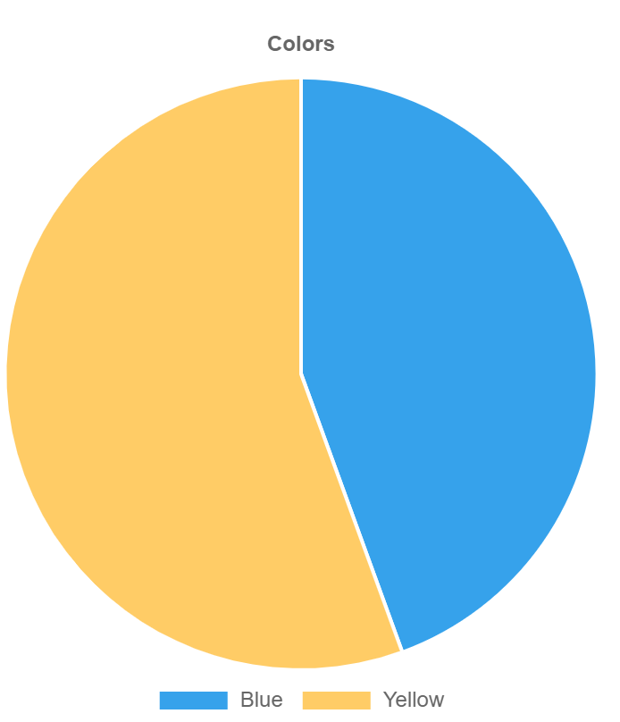
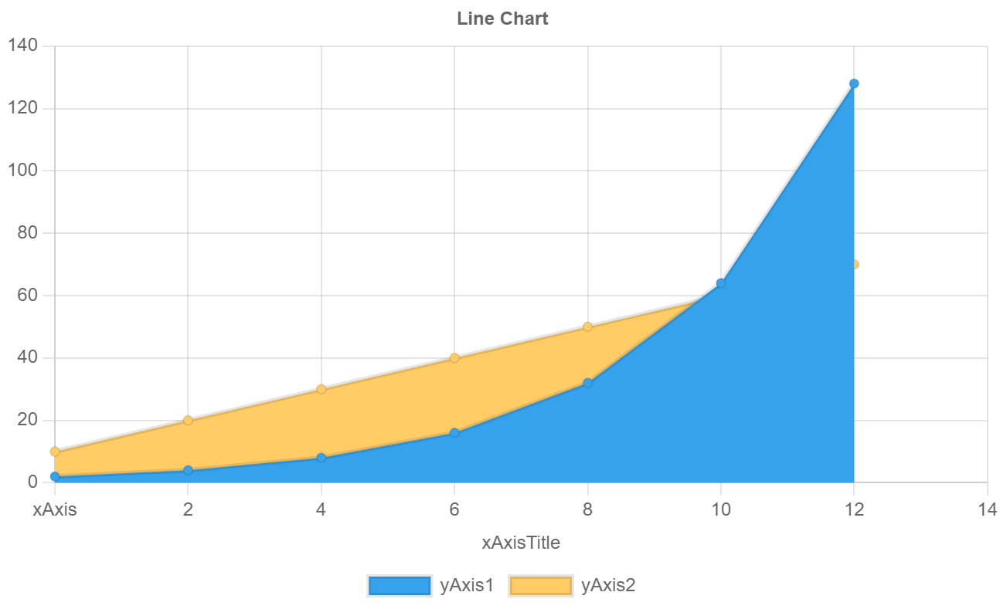
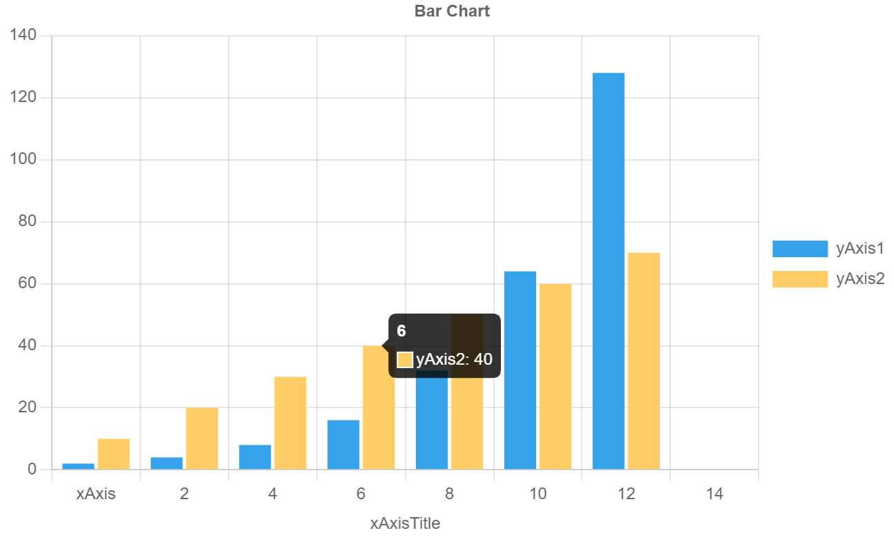
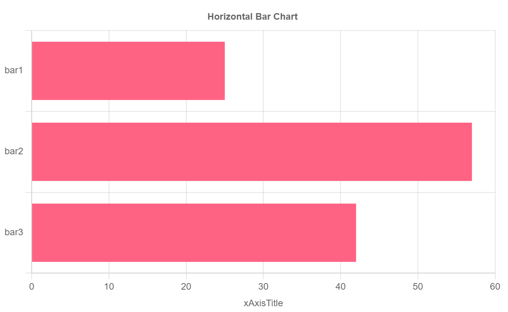

## discourse-chart

Displays charts in Discourse posts.

This plugin is built on the library: https://www.chartjs.org/docs/latest/

### Usage

```
[chart borderColors="#f45,#c83,#d76" title="Benchmark" type="line" xAxisTitle="Page"]
Page | Rails 4.1 | Rails 4.2 | Rails 4.3
Home | 1 | 2 |  3
About | 100 | 21|  32
User | 26 | 2 | 2
[/chart]
```

### Parameters & Options

| Parameter | Options |
|:-|-:|
| type | [pie, line, bar, horizontalBar]|
| borderColors | *hex values*|
| backgroundColors |  *hex values* |
| xAxisTitle | *text* |
| yAxisTitle | *text* |
| title | *text* |
| labels | *text* |

### Chart Type Examples

#### Pie Chart
```
[chart type="pie" backgroundColors="#36A2EB, #FFCC66" title="Colors" xAxisTitle="Page" ]
Blue | Yellow
4 | 5
[/chart]
```



#### Line Chart
```
[chart type="line" backgroundColors="#36A2EB, #FFCC66" title="Line Chart" xAxisTitle="xAxisTitle" ]
xAxis | 2 | 4 | 6 | 8 | 10 | 12 | 14
yAxis1 | 2 | 4 | 8 | 16 | 32 | 64 | 128
yAxis2 | 10 | 20 | 30 | 40 | 50 | 60 | 70
[/chart]
```



#### Bar Chart
```
[chart type="bar" backgroundColors="#36A2EB, #FFCC66" title="Bar Chart" xAxisTitle="xAxisTitle" ]
xAxis | 2 | 4 | 6 | 8 | 10 | 12 | 14
yAxis1 | 2 | 4 | 8 | 16 | 32 | 64 | 128
yAxis2 | 10 | 20 | 30 | 40 | 50 | 60 | 70
[/chart]
```



#### Horizontal Bar Chart
```
[chart type="horizontalBar" backgroundColors="#FF6384" title="Horizontal Bar Chart" xAxisTitle="xAxisTitle" ]
bar1 | 25
bar2 | 57
bar3 | 42
[/chart]
```



### Limitations

ChartJS offers many chart options but only a few are implemented here.
- [X] Line
- [X] Bar
- [ ] Radar
- [X] Pie
- [ ] Doughnut
- [ ] Polar Area
- [ ] Bubble
- [ ] Scatter
- [ ] Area
- [ ] Mixed Chart Types

There are also many other configuration options which may be of interest for advanced uses.
