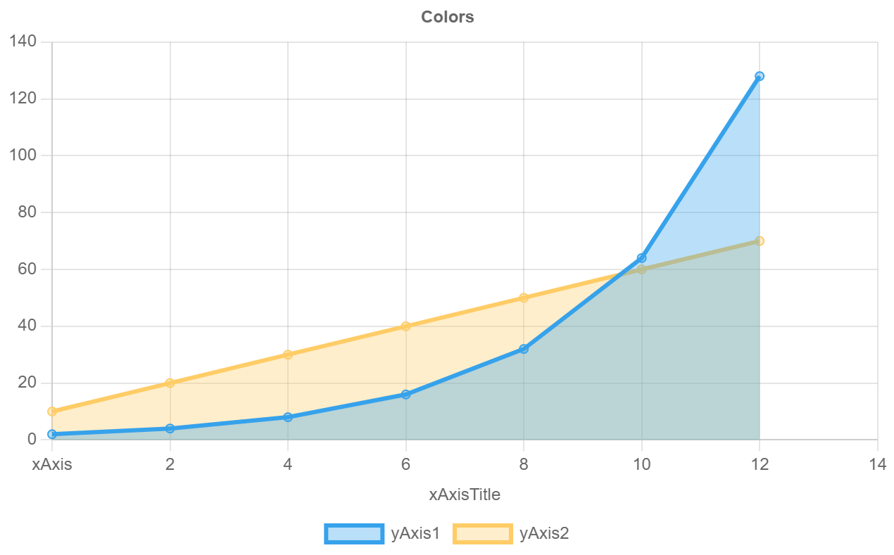

## discourse-chart

Displays charts in Discourse posts.

This plugin is built on the library: https://www.chartjs.org/docs/latest/

### Usage

```
[chart borderColors="#f45,#c83,#d76" title="Benchmark" type="line" xAxisTitle="Page"]
Page | Rails 4.1 | Rails 4.2 | Rails 4.3
Home | 1 | 2 |  3
About | 100 | 21|  32
User | 26 | 2 | 2
[/chart]
```

### Parameters & Options

| Parameter | Options |
|:-|-:|
| type | [pie, doughnut, line, bar, horizontalBar]|
| borderColors | *hex values*|
| backgroundColors |  *hex values* |
| xAxisTitle | *text* |
| yAxisTitle | *text* |
| title | *text* |
| labels | *text* |

### Chart Type Examples

#### Pie Chart
```
[chart type="pie" backgroundColors="#36A2EB, #FFCC66" title="Colors" xAxisTitle="Page" ]
Blue | Yellow
4 | 5
[/chart]
```


#### Line Chart
```
[chart type="line" backgroundColors="#36A2EB, #FFCC66" title="Line Chart" xAxisTitle="xAxisTitle" ]
xAxis | 2 | 4 | 6 | 8 | 10 | 12 | 14
yAxis1 | 2 | 4 | 8 | 16 | 32 | 64 | 128
yAxis2 | 10 | 20 | 30 | 40 | 50 | 60 | 70
[/chart]
```


You can apply transparency to hexadecimal colors by appending 2 digits at the end which define the opacity of the color. This allows you to create more appealing line charts or colors. The list of hex codes are listed at the bottom of this README.

```
[chart type="line" borderColors="#36A2EB, #FFCC66" backgroundColors="#36A2EB57,#FFCC6657" title="Line Chart" xAxisTitle="xAxisTitle" ]
xAxis | 2 | 4 | 6 | 8 | 10 | 12 | 14
yAxis1 | 2 | 4 | 8 | 16 | 32 | 64 | 128
yAxis2 | 10 | 20 | 30 | 40 | 50 | 60 | 70
[/chart]
```



#### Bar Chart
```
[chart type="bar" backgroundColors="#36A2EB, #FFCC66" title="Bar Chart" xAxisTitle="xAxisTitle" ]
xAxis | 2 | 4 | 6 | 8 | 10 | 12 | 14
yAxis1 | 2 | 4 | 8 | 16 | 32 | 64 | 128
yAxis2 | 10 | 20 | 30 | 40 | 50 | 60 | 70
[/chart]
```


#### Horizontal Bar Chart
```
[chart type="horizontalBar" backgroundColors="#FF6384" title="Horizontal Bar Chart" xAxisTitle="xAxisTitle" ]
bar1 | 25
bar2 | 57
bar3 | 42
[/chart]
```


### Limitations

ChartJS offers many chart options but only a few are implemented here.
- [X] Line
- [X] Bar
- [ ] Radar
- [X] Pie
- [X] Doughnut
- [ ] Polar Area
- [ ] Bubble
- [ ] Scatter
- [ ] Area
- [ ] Mixed Chart Types

There are also many other configuration options which may be of interest for advanced uses.

### Transparent Hex Codes

Appending 2 digits to the end of a hex code will apply transparency to the color:

Red: #FE2D00
Red with 50% transparency: #FE2D0080

- **100% — FF**
- 99% — FC
- 98% — FA
- 97% — F7
- 96% — F5
- 95% — F2
- 94% — F0
- 93% — ED
- 92% — EB
- 91% — E8
- **90% — E6**
- 89% — E3
- 88% — E0
- 87% — DE
- 86% — DB
- 85% — D9
- 84% — D6
- 83% — D4
- 82% — D1
- 81% — CF
- **80% — CC**
- 79% — C9
- 78% — C7
- 77% — C4
- 76% — C2
- **75% — BF**
- 74% — BD
- 73% — BA
- 72% — B8
- 71% — B5
- **70% — B3**
- 69% — B0
- 68% — AD
- 67% — AB
- 66% — A8
- 65% — A6
- 64% — A3
- 63% — A1
- 62% — 9E
- 61% — 9C
- **60% — 99**
- 59% — 96
- 58% — 94
- 57% — 91
- 56% — 8F
- 55% — 8C
- 54% — 8A
- 53% — 87
- 52% — 85
- 51% — 82
- **50% — 80**
- 49% — 7D
- 48% — 7A
- 47% — 78
- 46% — 75
- 45% — 73
- 44% — 70
- 43% — 6E
- 42% — 6B
- 41% — 69
- **40% — 66**
- 39% — 63
- 38% — 61
- 37% — 5E
- 36% — 5C
- 35% — 59
- 34% — 57
- 33% — 54
- 32% — 52
- 31% — 4F
- **30% — 4D**
- 29% — 4A
- 28% — 47
- 27% — 45
- 26% — 42
- **25% — 40**
- 24% — 3D
- 23% — 3B
- 22% — 38
- 21% — 36
- **20% — 33**
- 19% — 30
- 18% — 2E
- 17% — 2B
- 16% — 29
- 15% — 26
- 14% — 24
- 13% — 21
- 12% — 1F
- 11% — 1C
- **10% — 1A**
- 9% — 17
- 8% — 14
- 7% — 12
- 6% — 0F
- 5% — 0D
- 4% — 0A
- 3% — 08
- 2% — 05
- 1% — 03
- **0% — 00**
